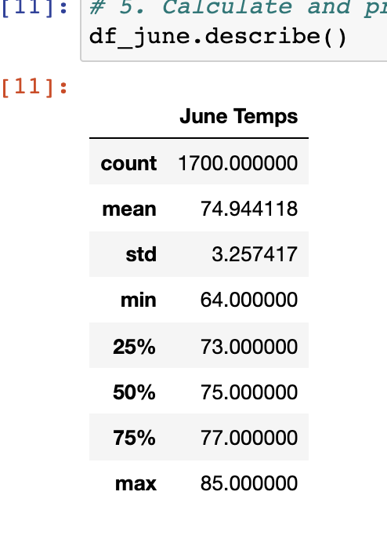
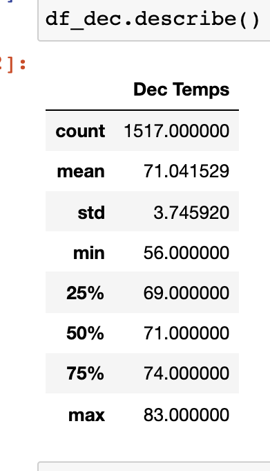

# surfs_up

## Overview of the statistical analysis
The purpose of this analysis is to find more information about temperature trends before opening the surf shop. Specifically, we are tasked to analyze temperature data for the months of June and December in Oahu so we can determine if the surf and ice cream shop business is sustainable year-round.

## Results

### June Temperature Statistics

As shown below, there are 1,700 observations for temperature in the month of June (From 2010 to 2017). The value of standard deviation, 3.75, indicates that temperature change throughout the month is small. Comparing this value to the December's value, it's smaller by 0.5 and it makes sense because usually temperature goes up and down relatively drastically in the winter.

### December Temperature Statistics

There are 1,517 observations for temperature in the month of December (From 2010 to 2017). This seems odd since there are more calendar days in December than in June. It can only be explained if there were some records lost during data collection. Nonetheless, since the difference isn't too substantial, this shouldn't affect the quality of the insights we can deduce from this summary. Almost every corresponding value is lower in this summary and this makes sense as well since temperature is always going to be lower in the winter.

## Summary
Comparing each corresponding value in both summaries, it won't be wrong to state that temperature is quite mild throughout the year and as a result, we can advise W.Avy that the surf and ice cream shop business would be sustainable year-round. However, what we cannot know from these summaries is the level of precipitation. To elaborate, it may be 70-80 degrees outside while it's raining and that's not the best condition for people to go surf and eat ice cream. Therefore, we probably have to do one more analysis on precipitation to get more comprehensive pictures of what the weather is going to be in Oahu.

On top of that, we should also include another query to find out the most active station so that we know the optimal location to start the business. Combined with the insights we gather from the weather data, this will give us a lot better chance for a more thriving business.
